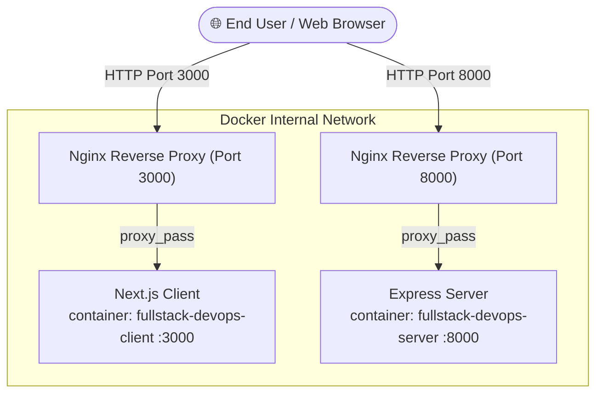

# Fullstack DevOps & Infrastructure Guide

This document covers the core system architecture, Docker containerization, Nginx reverse proxy integration, Node.js upgrades, and build optimizations.

> 💡 **Looking for Deployment Guides?**
> * 🤖 [Automatic Deployment Guide (CI/CD)](./AUTOMATIC_DEPLOYMENT.md)
> * 🛠️ [Manual Deployment Guide (VPS & Local)](./MANUAL_DEPLOYMENT.md)

---

## 1. System Architecture



### Components Summary:
* **Nginx Reverse Proxy**: Dual entry points listening on ports `3000` (Client) and `8000` (Server API / WebSockets). Proxies requests to internal client (`:3000`) and server (`:8000`) containers.
* **Client**: Next.js 16 (React 19, TailwindCSS v4) running on internal port `3000`.
* **Server**: Express v5 REST API written in TypeScript built using `tsdown` (Rolldown bundler) running on internal port `8000`.
* **Docker Compose**: Orchestrates multi-stage container builds and internal networking.

---

## 2. Nginx Reverse Proxy Setup (`nginx/default.conf`)

Nginx routes public requests from host ports `3000` and `8000` to internal application containers:

```nginx
# Client Proxy (Port 3000)
server {
    listen 3000;
    server_name localhost;

    location / {
        proxy_pass http://client:3000;
        proxy_http_version 1.1;
        proxy_set_header Upgrade $http_upgrade;
        proxy_set_header Connection 'upgrade';
        proxy_set_header Host $host;
    }
}

# Backend API & Socket.io Server Proxy (Port 8000)
server {
    listen 8000;
    server_name localhost;

    location / {
        proxy_pass http://server:8000;
        proxy_http_version 1.1;
        proxy_set_header Upgrade $http_upgrade;
        proxy_set_header Connection "upgrade";
        proxy_set_header Host $host;
        proxy_read_timeout 86400s;
        proxy_send_timeout 86400s;
    }
}
```

---

## 3. Docker Setup & Multi-Stage Builds

Both `client` and `server` services use Docker multi-stage builds (`builder` stage and `runner` stage) to ensure minimal image size and fast build execution.

### Server Dockerfile (`server/Dockerfile`)
```dockerfile
FROM node:22-alpine AS builder

WORKDIR /app
COPY package*.json ./
RUN npm ci
COPY . .
RUN npm run build

FROM node:22-alpine AS runner

WORKDIR /app
ENV NODE_ENV=production
COPY --from=builder /app/package*.json ./
COPY --from=builder /app/dist ./dist
COPY --from=builder /app/node_modules ./node_modules

EXPOSE 8000
CMD ["node", "dist/server.mjs"]
```

### Client Dockerfile (`client/Dockerfile`)
```dockerfile
FROM node:22-alpine AS builder

WORKDIR /app
COPY package*.json ./
RUN npm ci
COPY . .
RUN npm run build

FROM node:22-alpine AS runner

WORKDIR /app
ENV NODE_ENV=production
COPY --from=builder /app/package*.json ./
COPY --from=builder /app/.next ./.next
COPY --from=builder /app/public ./public
RUN npm ci --omit=dev

EXPOSE 3000
CMD ["npm", "start"]
```

---

## 4. Node.js Version & `Promise.withResolvers` Resolution

### Issue Encountered
During `docker compose up --build`, the server build failed with:
`TypeError: Promise.withResolvers is not a function` at `tsdown` build phase.

### Cause
`tsdown` (v0.22.14) relies on ECMAScript `Promise.withResolvers`, which requires Node.js **v22.0.0+** (or v20.13.0+). The older `node:20-alpine` base image in Docker lagged behind this requirement.

### Fix Applied
Updated base images in both `server/Dockerfile` and `client/Dockerfile` from `node:20-alpine` to `node:22-alpine` (aligning with Node 22 specified in GitHub Actions CI).

---

## 5. Docker Build Context Optimization (`.dockerignore`)

### Issue Encountered
Docker context transfer was taking over **94 seconds** uploading **135 MB+** of data for the client build context.

### Cause
Without a `.dockerignore` file, Docker was transferring local `node_modules/`, `.next/` cache, `.git/`, and build artifacts across the Docker daemon socket prior to building.

### Fix Applied
Created `.dockerignore` files for both microservices:

#### `client/.dockerignore` & `server/.dockerignore`:
```gitignore
node_modules
.next
dist
build
.git
.gitignore
npm-debug.log*
.env*
```

### Impact
* **Context transfer size**: Reduced from **135 MB+ down to ~1 MB**.
* **Context transfer speed**: Reduced from **94 seconds down to < 1 second**.

---

## 6. Docker Compose Configuration (`docker-compose.yml`)

```yaml
services:

  client:
    build:
      context: ./client
      dockerfile: Dockerfile
    container_name: fullstack-devops-client
    restart: always

  server:
    build:
      context: ./server
      dockerfile: Dockerfile
    container_name: fullstack-devops-server
    restart: always

  nginx:
    image: nginx:alpine
    container_name: fullstack-devops-nginx
    ports:
      - "3000:3000" # [Host Machine Port - CLIENT] : [Inside Nginx Container Port]
      - "8000:8000" # [Host Machine Port - SERVER] : [Inside Nginx Container Port]
      # This tells Nginx to recieve traffic on host/local port 8000 and 3000 inside Nginx container
    volumes:
      - ./nginx/default.conf:/etc/nginx/conf.d/default.conf:ro
    depends_on:
      - client
      - server
    restart: always
```
