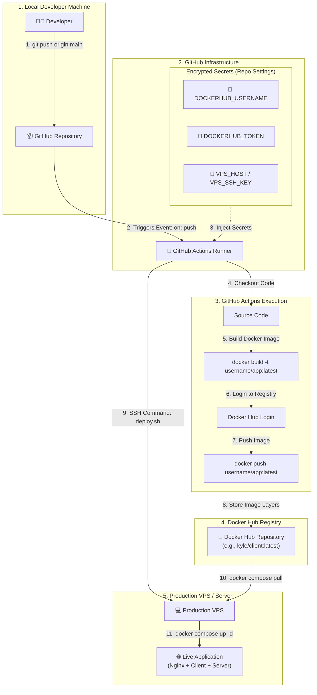

# GitHub Actions & Docker Hub Integration Workflow

This document provides a complete start-to-finish overview of how **GitHub**, **GitHub Actions**, **Docker Hub**, and your **VPS** work together, including the system flowchart and required data/credentials.

---

## 1. System Architecture & Process Flowchart



---

## 2. Start-to-Finish Execution Steps

| Step | Phase | Executed By | Action | Required Data / Input | Artifact Output |
| :--- | :--- | :--- | :--- | :--- | :--- |
| **1** | Trigger | Developer | `git push origin main` | Local Git commits, Repository URL | Commit on GitHub |
| **2** | Event Listen | GitHub Platform | Detects push event | `.github/workflows/ci.yml` | Runner VM spun up |
| **3** | Secret Injection | GitHub Platform | Loads encrypted secrets | GitHub Secrets store | Env vars in runner context |
| **4** | Code Checkout | Actions Runner | Clones repository code | Commit SHA / Branch ref | Workspace files in runner |
| **5** | Docker Build | Actions Runner | Builds Client & Server images | `Dockerfile`, `package.json`, source files | Local container images |
| **6** | Auth Check | Actions Runner | Logs into Docker Hub | `DOCKERHUB_USERNAME`, `DOCKERHUB_TOKEN` | Registry Auth Token |
| **7** | Image Push | Actions Runner | Pushes image layers to registry | Container images | Remote image hosted on Docker Hub |
| **8** | SSH Deploy | Actions Runner | Triggers deployment on VPS | `VPS_HOST`, `VPS_USERNAME`, `VPS_SSH_KEY`, `VPS_PORT` | Remote shell session |
| **9** | Image Pull | VPS | Pulls updated Docker images | `docker-compose.yml`, Docker Hub registry | Fresh image layers on VPS |
| **10**| Container Swap | VPS | Restarts updated services | `docker compose up -d` | Live containers running |

---

## 3. Required Data & Secrets Setup Matrix

### A. Docker Hub Account
* **Location**: [hub.docker.com](https://hub.docker.com)
* **Generated Data**: Personal Access Token (PAT) under **Account Settings > Security**.
* **Permissions**: `Read, Write`.

### B. GitHub Repository Secrets
* **Location**: **GitHub Repo > Settings > Secrets and variables > Actions**
* **Secrets Required**:

| Secret Key | Source | Description |
| :--- | :--- | :--- |
| `DOCKERHUB_USERNAME` | Docker Hub | Your Docker Hub account username |
| `DOCKERHUB_TOKEN` | Docker Hub | Personal Access Token generated from Docker Hub |
| `VPS_HOST` | Hostinger / Server Provider | Public IP address of your VPS |
| `VPS_USERNAME` | VPS Operating System | SSH user (e.g. `root` or `ubuntu`) |
| `VPS_SSH_KEY` | Local SSH Key Pair | Private SSH key matching `authorized_keys` on VPS |
| `VPS_PORT` | VPS SSH Config | SSH Port (default `22`) |

---

## 4. Complete GitHub Actions Workflow Script

File location: `.github/workflows/ci.yml`

```yaml
name: "CI/CD & Docker Hub Deployment Pipeline"

on:
  push:
    branches: [main, master]
  pull_request:
    branches: [main, master]

jobs:
  build-and-push:
    name: "Build & Push to Docker Hub"
    runs-on: ubuntu-latest
    steps:
      - name: "Checkout repository"
        uses: actions/checkout@v4

      - name: "Log in to Docker Hub"
        uses: docker/login-action@v3
        with:
          username: ${{ secrets.DOCKERHUB_USERNAME }}
          password: ${{ secrets.DOCKERHUB_TOKEN }}

      - name: "Build & Push Server Image"
        uses: docker/build-push-action@v5
        with:
          context: ./server
          push: true
          tags: ${{ secrets.DOCKERHUB_USERNAME }}/fullstack-devops-server:latest

      - name: "Build & Push Client Image"
        uses: docker/build-push-action@v5
        with:
          context: ./client
          push: true
          tags: ${{ secrets.DOCKERHUB_USERNAME }}/fullstack-devops-client:latest

  deploy-to-vps:
    name: "Deploy to VPS"
    needs: build-and-push
    if: github.ref == 'refs/heads/main' && github.event_name == 'push'
    runs-on: ubuntu-latest
    steps:
      - name: "Execute remote deployment script via SSH"
        uses: appleboy/ssh-action@v1.0.3
        with:
          host: ${{ secrets.VPS_HOST }}
          username: ${{ secrets.VPS_USERNAME }}
          key: ${{ secrets.VPS_SSH_KEY }}
          port: ${{ secrets.VPS_PORT || 22 }}
          script: |
            cd /var/www/fullstack-devops
            docker compose pull
            docker compose up -d --remove-orphans
            docker image prune -f
```

---

## 5. Related Documentation Links

* 📄 [Docker Hub Setup & Manual CLI Commands](./DOCKERHUB_SETUP.md)
* 📄 [System Architecture & Nginx Configuration](./DEVOPS_SETUP.md)
* 📄 [Hostinger VPS Initial Setup Guide](./HOSTINGER_VPS_GUIDE.md)
* 📄 [Automatic SSH Deployment Guide](./AUTOMATIC_DEPLOYMENT.md)
