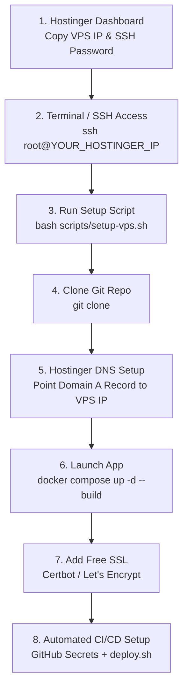

# Hostinger VPS Deployment Guide (SSH to Production)

This guide provides a complete, step-by-step walkthrough for deploying this project on a **Hostinger VPS** (or any Ubuntu VPS) starting from initial SSH access to final live production with SSL/HTTPS.

---

## 📋 Deployment Overview Workflow



---

## 🛠️ Step-by-Step Walkthrough

### Step 1: Obtain Hostinger VPS Credentials
1. Log into your [Hostinger hPanel](https://hpanel.hostinger.com/).
2. Navigate to **VPS** tab ➔ Select your VPS server.
3. Note your credentials:
   - **IP Address**: e.g., `185.185.185.185`
   - **SSH Username**: `root`
   - **SSH Password / SSH Key**

---

### Step 2: First-Time SSH Connection from your PC
Open terminal (Mac/Linux) or PowerShell (Windows) and connect:

```bash
ssh root@185.185.185.185
```
*(Type `yes` when prompted for fingerprint, then enter your Hostinger root password).*

---

### Step 3: Server Environment Initialization
Run the system update and execute our [`scripts/setup-vps.sh`](file:///c:/Users/Kyle%20Ando/Desktop/practice/fullstack-devops/scripts/setup-vps.sh) script to install Docker & Docker Compose automatically:

```bash
# Update Ubuntu packages
apt update && apt upgrade -y

# Clone repo & run setup script
git clone https://github.com/YOUR_GITHUB_USERNAME/fullstack-devops.git /var/www/fullstack-devops
cd /var/www/fullstack-devops

# Execute VPS setup script
bash scripts/setup-vps.sh
```

---

### Step 4: Configure Hostinger DNS (Domain Setup)
1. Go to **Hostinger hPanel > Domains > DNS / Nameservers**.
2. Add an **A Record** pointing your domain to your Hostinger VPS IP:
   - **Type**: `A`
   - **Name**: `@` (or `yourdomain.com`)
   - **Points to / Value**: `185.185.185.185` *(your Hostinger VPS IP)*
   - **TTL**: `3600`

---

### Step 5: Launch Containers with Docker Compose
From your SSH terminal on the VPS (`/var/www/fullstack-devops`):

```bash
docker compose up -d --build
```
Verify all containers are running:
```bash
docker compose ps
```
You should see 3 running containers: `fullstack-devops-client`, `fullstack-devops-server`, and `fullstack-devops-nginx`.

---

### Step 6: Enable Free SSL / HTTPS (Certbot)
To enable HTTPS (`https://yourdomain.com`), install Certbot on the Hostinger VPS:

```bash
# Install Certbot
apt install -y certbot python3-certbot-nginx

# Obtain SSL Certificate for your domain
certbot --nginx -d yourdomain.com -d www.yourdomain.com
```
Certbot automatically updates Nginx configuration to support HTTPS (`443`) and sets up auto-renewal!

---

### Step 7: Configure Automated GitHub CI/CD Deployments
To make future updates deploy automatically when pushing to GitHub:

1. Copy your VPS SSH Key or Password into GitHub (**Settings > Secrets > Actions**):
   - `VPS_HOST`: `185.185.185.185`
   - `VPS_USERNAME`: `root`
   - `VPS_SSH_KEY`: Your SSH Private Key
2. Now, every push to `master` or `main` will automatically trigger [`scripts/deploy.sh`](file:///c:/Users/Kyle%20Ando/Desktop/practice/fullstack-devops/scripts/deploy.sh) on your Hostinger VPS!

---

## 🎯 Verification Checklist

- [x] Hostinger VPS IP connected via SSH.
- [x] Docker & Docker Compose installed via `scripts/setup-vps.sh`.
- [x] DNS A Record pointing to VPS IP.
- [x] Containers running via `docker compose up -d --build`.
- [x] Nginx serving frontend on port `80` / `443` and proxying API calls to `/api/`.
- [x] Free SSL active via Certbot.
